# flutter_gradient_colors

A new Flutter package project.

# Show some :heart: and star the repo to support the project

| # ScreenShots                 | # Screenshot                                        |  # ScreenShots                                  |
| ----------------------------  | --------------------------------------------------- | ----------------------------------------------- |
|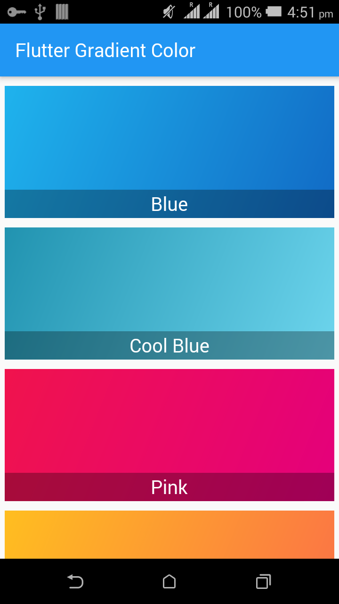|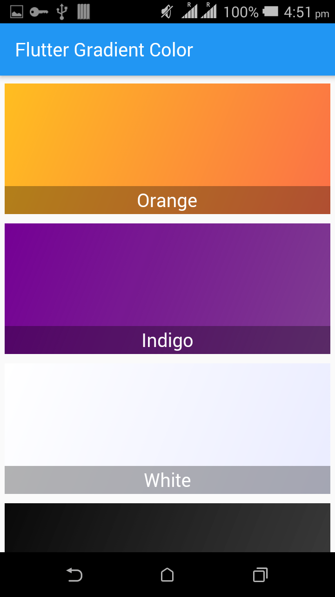| 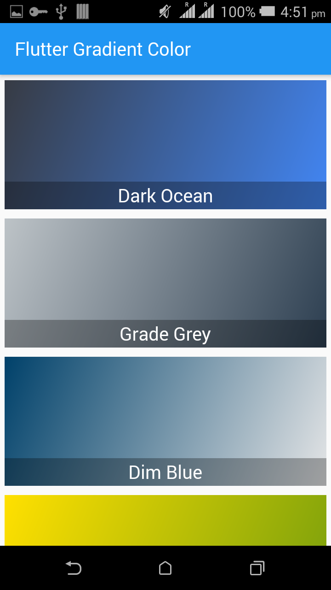                            |
|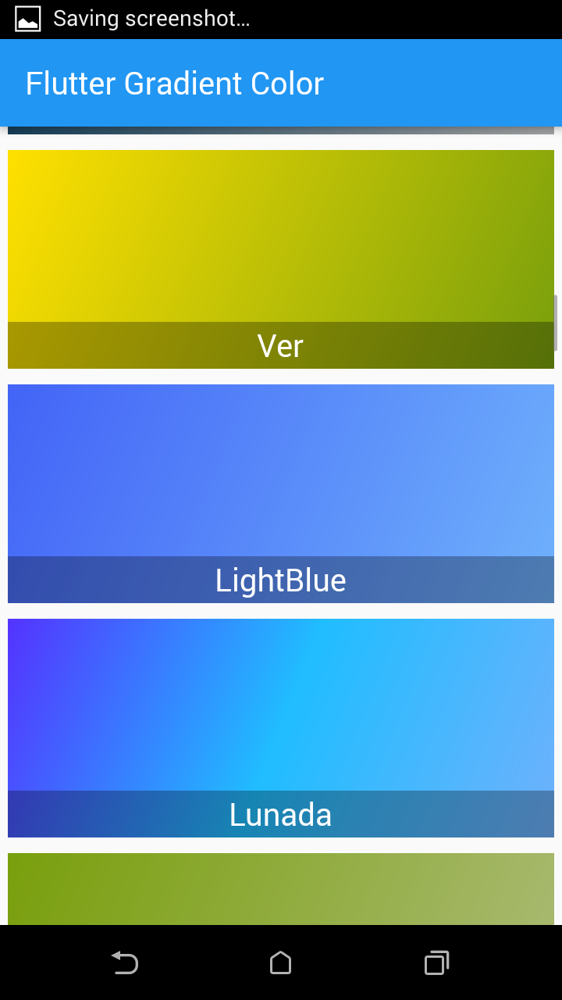|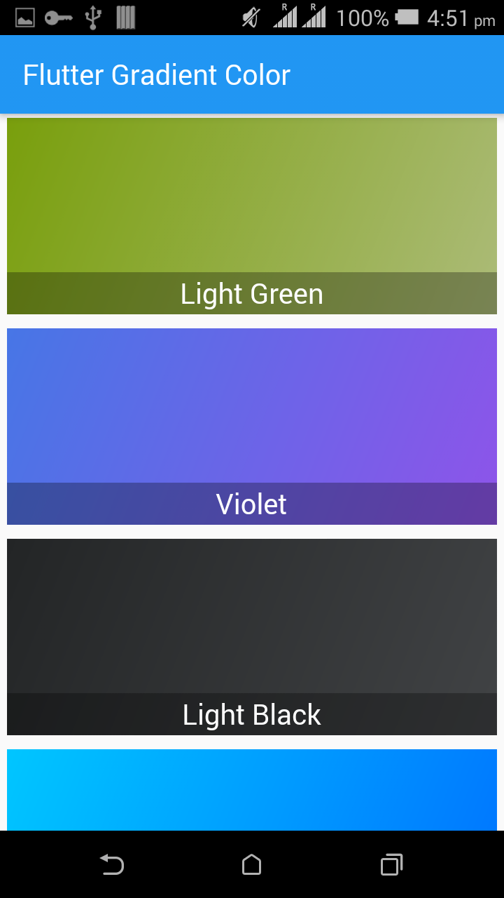| 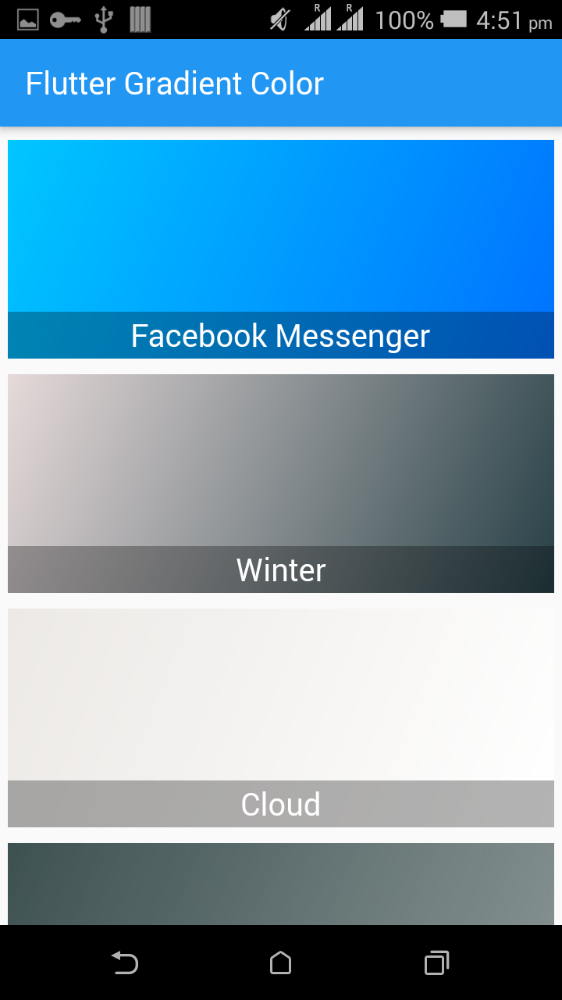                            |
|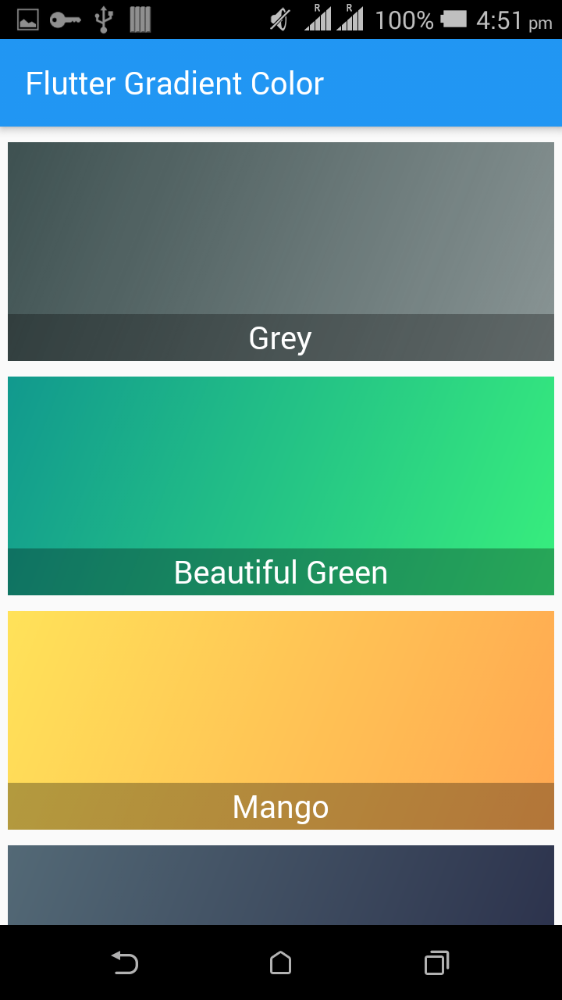|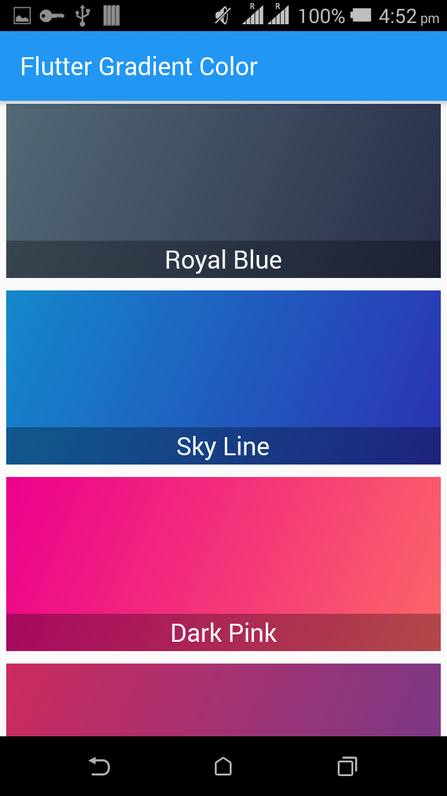| 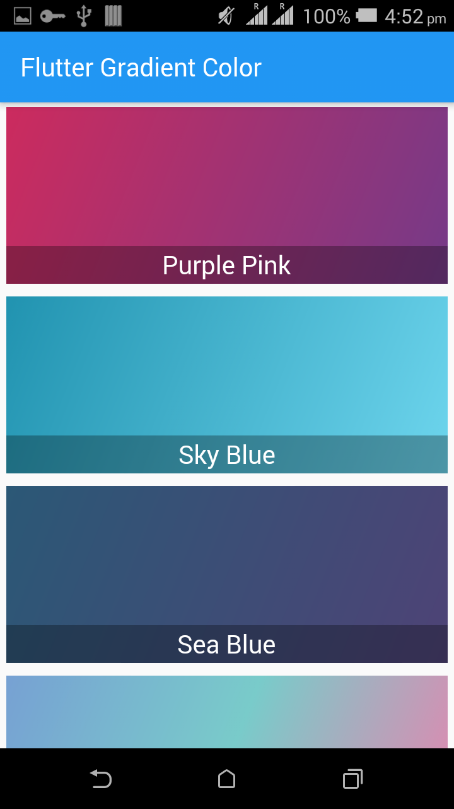                            |
|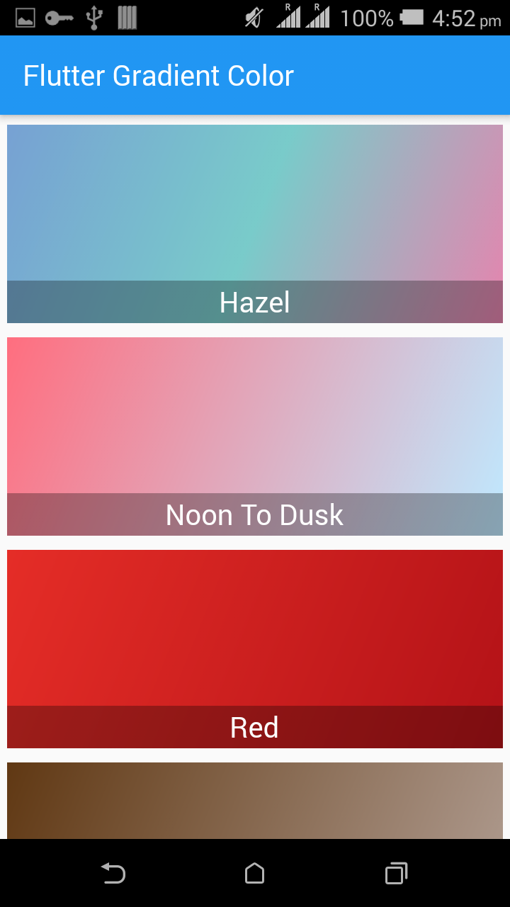|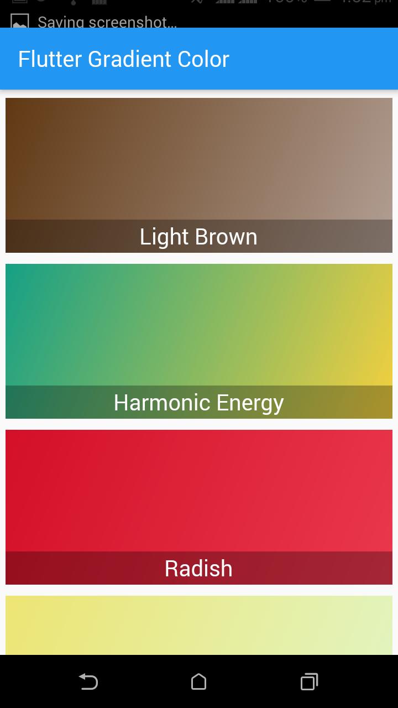| 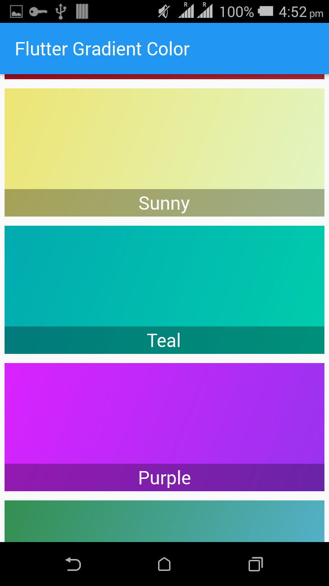   
|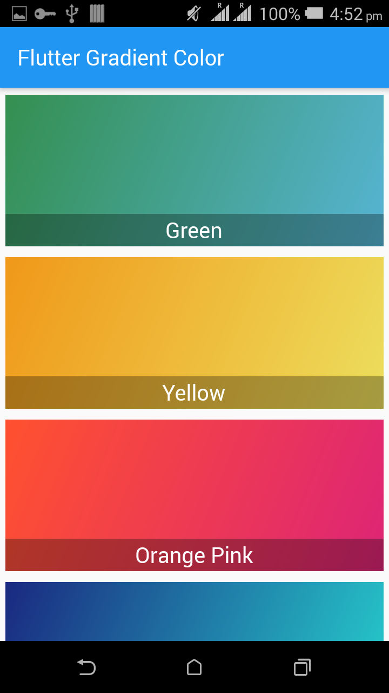|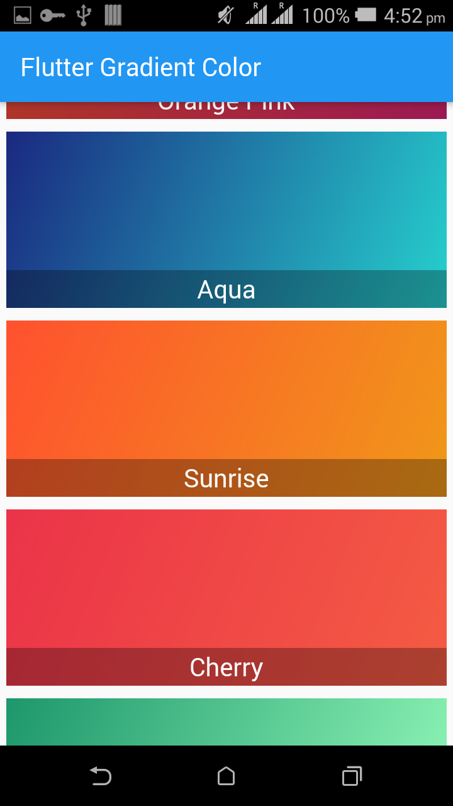| 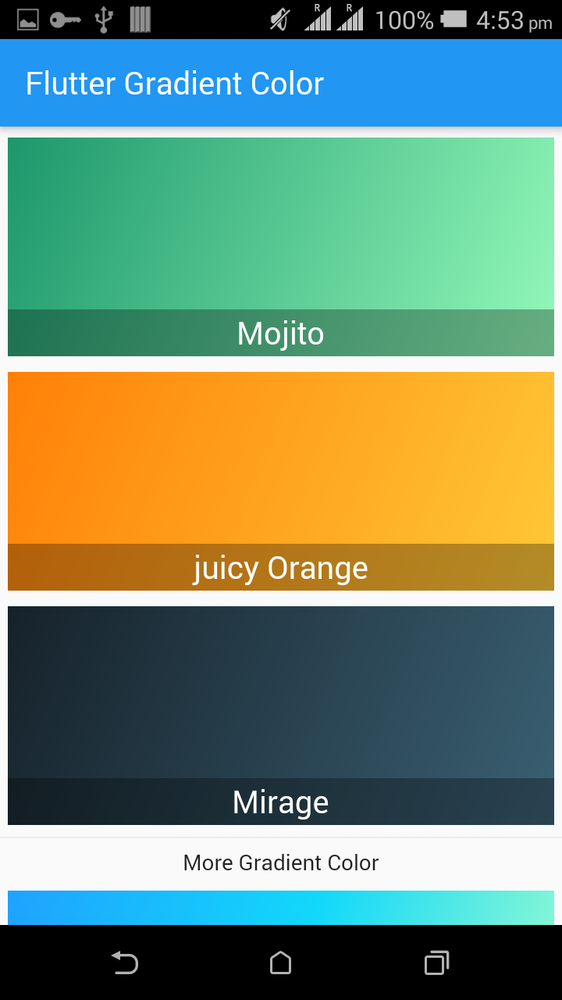   
|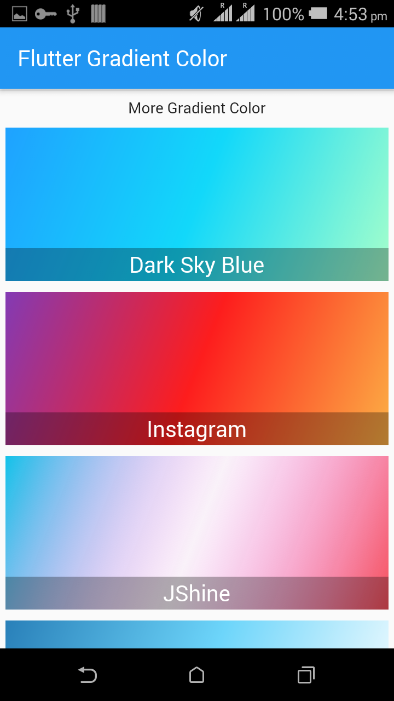|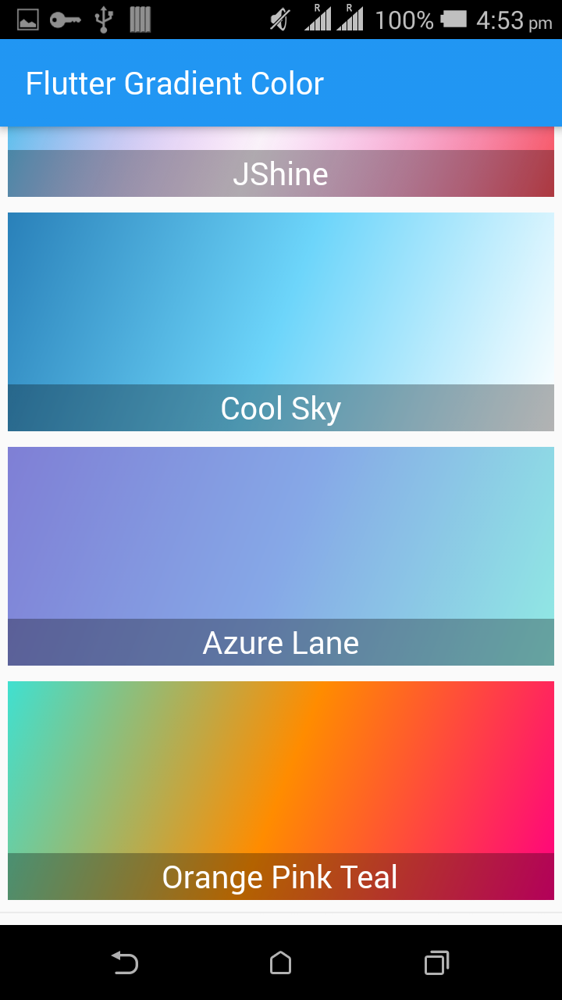||

# Types of Gradient Color class
```
      1. GradientColor class: In this Gradient color class we use two colors for gradient color, so use only two value for stop otherwise you will face error. 
        eg. Container(
            margin: EdgeInsets.only(top: 10.0),
            width: MediaQuery.of(context).size.width - 10,
            height: 140,
            decoration: BoxDecoration(
                gradient: LinearGradient(
              begin: Alignment.topLeft,
              end: Alignment.bottomRight,
              colors: GradientColors.blue,
              stop:[
              0.6,
              0.7
              ]
            )),
          ),
      
      2. MoreGradientColor class: In this Gradient color class we use three colors for gradient color, so use only three value for stop otherwise you will face error.
      
      eg. Container(
            margin: EdgeInsets.only(top: 10.0),
            width: MediaQuery.of(context).size.width - 10,
            height: 140,
            decoration: BoxDecoration(
                gradient: LinearGradient(
              begin: Alignment.topLeft,
              end: Alignment.bottomRight,
              colors: MoreGradientColors.instagram,
              stop:[
              0.3,
              0.6,
              0.9
              ]
            )),
          ),
```

# Colors List (GradientColors)

| # Color Name                        | # Color Name                           |  # Color Name                               |
| ----------------------------------- | -------------------------------------- | ------------------------------------------- |
|   blue                              |     pink                               |   orange                                    |
|   indigo                            |     white                              |   black                                     |
|   piggyPink                         |     coolBlues                          |   eveningSunshine                           |
|   darkOcean                         |     gradeGrey                          |   dimBlue                                   |
|   ver                               |     lightBlue                          |   lightGreen                                |
|   mango                             |     royalBlue                          |   skyLine                                   |
|   darkPink                          |     purplePink                         |   purplePink                                |
|   skyBlue                           |     seaBlue                            |   noontoDusk                                |
|   red                               |     lightBrown                         |   harmonicEnergy                            |
|   radish                            |     sunny                              |   teal                                      |
|   purple                            |     green                              |   yellow                                    |
|   orangePink                        |     aqua                               |   sunrise                                   |
|   cherry                            |     mojito                             |   juicyOrange                               |
|   mirage                            |     violet                             |   lightBlack                                |
|   facebookMessenger                 |     winter                             |   cloud                                     |
|   grey                              |     beautifulGreen                     |                                             |


# Colors List (MoreGradientColors)

| # Color Name                        | # Color Name                           |  # Color Name                               |
| ----------------------------------- | -------------------------------------- | ------------------------------------------- |
|   hazel                             |     darkSkyBlue                        |   instagram                                 |
|   jShine                            |     coolSky                            |   azureLane                                 |
|   orangePinkBlue                    |     lunada                             |                                             |

